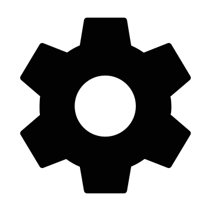

# Icon Collection

This repo contains a curated set of SVG icons. Add new SVG files to `src/icons`, then run `npm run update:icons` to refresh this gallery.

| Icon | Icon | Icon | Icon | Icon | Icon |
| --- | --- | --- | --- | --- | --- |
|  account nndwn bold round |  account nndwn line round |  ambulance nndwn bold |  back nndwn line round |  back nndwn line |  book nndwn bold |
|  bookmark nndwn line |  bucket nndwn bold |  bug nndwn bold |  burger nndwn line |  clear nndwn line |  coffe nndwn bold round |
|  coffe nndwn solid |  color full nndwn solid |  color nndwn solid |  comment nndwn line |  crown bold |  dentis |
|  doctor |  down nndwn solid round |  down02 nndwn line |  edit light |  eye close bold |  eye open bold |
|  eyeclose |  eyeopen |  facebook bold |  flash nndwn solid |  history light |  home light |
|  info bold |  info light |  instagram bold |  key bold |  lock round bold |  love bold |
|  love light round |  love line |  moon light |  music note nndwn solid |  notif light |  notifhasmark |
|  notifnotmark |  padlock |  patologi |  pause play bold |  phone light |  play bold |
|  point light |  pskolog |  runtext nndwn solid |  schedule light |  search light |  settings bold |
|  share light |  star bold |  stop play bold |  sun light |  surgeon nndwn bold |  tiktok bold |
|  timer nndwn line round |  timer nndwn solid round |  todo |  translate bold |  translate light |  up02 nndwn line |
|  user light |  wallet bold |  wave nndwn solid |  whatsapp bold |  wifi bold round |  wifi light |
|  youtube bold |  |  |  |  |  |

Total icons: 73
